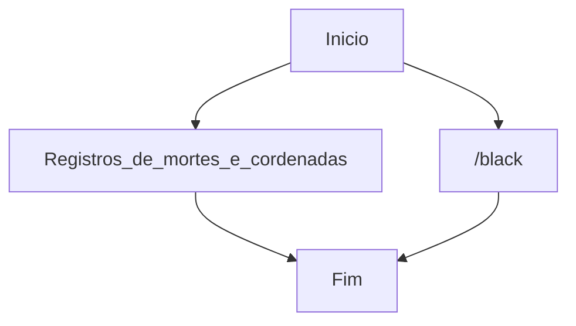

# DD na verdade e o comando /black para voltar quando morreu ao ponto de origem 

Cuidado, o assassino sempre volta ao local do crime: o Mob Zumbi dos Palmares.

Zumbi dos Palmares foi um dos líderes do Quilombo dos Palmares e ficou conhecido por ter liderado a resistência do quilombo contra os ataques portugueses da Historia Brasileira
A verdade é que o canibalismo (ou algo parecido com isso) de fato já foi uma realidade no Brasil, principalmente antes dos europeus chegarem em nossas terras

Curiozidades os Zombies sempre fala Mauri Mauri Mauri e os Vilages E RA e RA o chefe do trabalho da piramide da Fortuna...

e no nether (inferno) so tem porco porque je-ssus coloco os espiritos ruim la (JE.SUS derivado de SUS)... Jogo apocaliptico de filmes

Minicraft versao testada 1.20 pois exite varias mas esta esta atulizada...
# Languem Support

BR, EN, ES, FR, DE
RU, ZH, ZH-TW, JA
KO, IT, NL, PL, SV,
CS, HU, TR, AR, FI, DA

# Plugin

Support Enable & Disable Plugin

Compiler file app\build\libs\Black-1.33.jar

