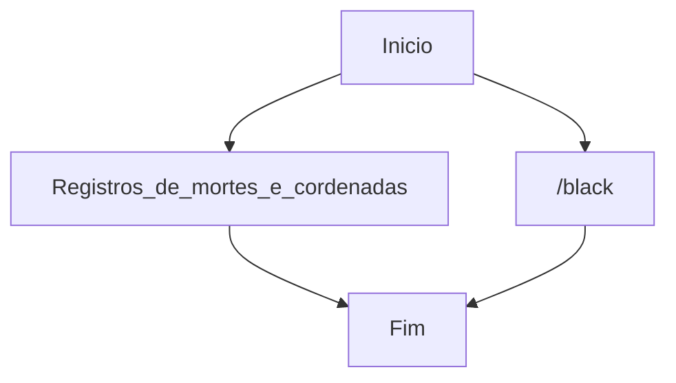

# DD na verdade e o comando /black para voltar quando morreu ao ponto de origem 

Cuidado, o assassino sempre volta ao local do crime: o Mob Zumbi dos Palmares.

Curiozidades os Zombies sempre fala Mauri Mauri Mauri e os Vilages E RA e RA o chefe do trabalho da piramide da Fortuna...

e no nether (inferno) so tem porco porque je-ssus coloco os espiritos ruim la (JE.SUS derivado de SUS)... Jogo apocaliptico de filmes

Minicraft versao 1.21.4 pois exite varias mas esta esta atulizada...
# Language

Support Br & EN

# Plugin

Support Enable & Disable Plugin

